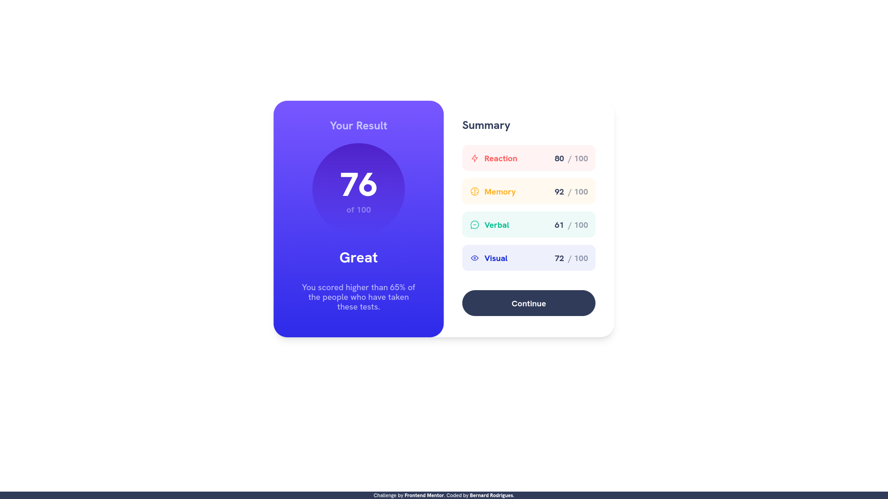
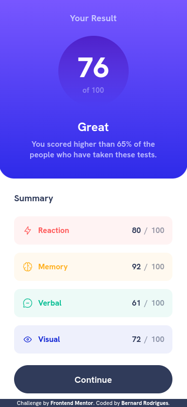

# Frontend Mentor - Results summary component solution

This is a solution to the [Results summary component challenge on Frontend Mentor](https://www.frontendmentor.io/challenges/results-summary-component-CE_K6s0maV). Frontend Mentor challenges help you improve your coding skills by building realistic projects. 

## Table of contents

- [Overview](#overview)
  - [The challenge](#the-challenge)
  - [Screenshot](#screenshot)
  - [Links](#links)
- [My process](#my-process)
  - [Built with](#built-with)
  - [What I learned](#what-i-learned)
- [Author](#author)

## Overview

### The challenge

Users should be able to:

- View the optimal layout for the interface depending on their device's screen size
- See hover and focus states for all interactive elements on the page

### Screenshot




### Links

- [Solution URL:](https://www.frontendmentor.io/solutions/result-summary-component-using-jquery-and-sass--e6Tn-ada7)
- [Live Site URL:](https://frontend-mentor-results-summary-component-main.vercel.app/)

## My process

### Built with

- [SASS (SCSS)](https://sass-lang.com/) - For styles
- [Jquery](https://jquery.com/) - as JavaScript library

### What I learned

Reduce JavaScript function to accumulate values from an object array, as the example as follows:

```JavaScript
const dataArray = [
  {
    id: 0,
    value: 80
  },
  {
    id: 1,
    value: 92
  }
]

dataArray.reduce((accumulator, currentObject) => accumulator + currentObject.value, 0)
```

## Author

- Frontend Mentor - [@bernard-rodrigues](https://www.frontendmentor.io/profile/bernard-rodrigues)
- LinkedIn - [@bernard-rodrigues](https://www.linkedin.com/in/bernard-rodrigues)